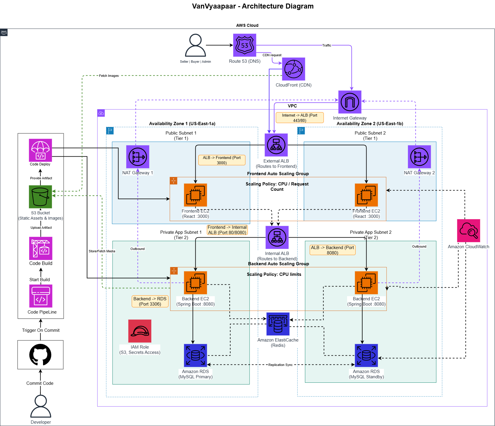

# VanVyaapaar — Tribal Crafts E-Commerce on AWS

> A production-grade, cloud-native e-commerce platform for tribal artisans, fully deployed on AWS with automated CI/CD pipeline.

---

## Architecture



---

## AWS Infrastructure

All infrastructure is defined as **Infrastructure as Code** using AWS CloudFormation — single command deploys the entire production environment.

| Service | Role |
|---|---|
| **VPC** | Isolated network with public + private subnets across 2 Availability Zones |
| **EC2 + Auto Scaling Groups** | Frontend (nginx) and Backend (Spring Boot) with auto scaling |
| **Application Load Balancer** | Routes `/auth/*`, `/buyer/*`, `/seller/*`, `/admin/*` to backend — everything else to frontend |
| **RDS MySQL** | Managed database in private subnet, never publicly accessible |
| **S3** | Product image storage |
| **CloudFront** | CDN for serving product images globally |
| **Secrets Manager** | RDS credentials stored securely, never hardcoded |
| **IAM Roles** | Least-privilege roles for EC2, CodeDeploy, CodeBuild |
| **SSM** | Remote instance management without SSH |

---

## CI/CD Pipeline


Every `git push` to `main` automatically builds and deploys the full application.

```
git push origin main
        │
        ▼
   CodePipeline
        │
   ┌────┴────┐
   │ SOURCE  │  Pulls latest code from GitHub
   └────┬────┘
        │
   ┌────┴────┐
   │  BUILD  │  CodeBuild — Frontend (npm build) + Backend (mvn package) in parallel
   └────┬────┘
        │
   ┌────┴────┐
   │ DEPLOY  │  CodeDeploy — Frontend → FrontendASG | Backend → BackendASG
   └─────────┘
```

**CodeDeploy Lifecycle:**
- `BeforeInstall` → install dependencies (Java 17 / nginx)
- `Install` → copy artifacts to EC2
- `ApplicationStart` → fetch RDS credentials from Secrets Manager → start app
- `ValidateService` → health check before marking deployment successful

---

## CloudFormation Templates

| Template | Description |
|---|---|
| [`cloudformation/infrastructure.yaml`](cloudformation/infrastructure.yaml) | Entire AWS infrastructure — VPC, EC2, ASG, ALB, RDS, S3, CloudFront, IAM, Security Groups |
| [`cloudformation/infrastructure-cicd.yaml`](cloudformation/infrastructure-cicd.yaml) | Full CI/CD pipeline — CodePipeline, CodeBuild, CodeDeploy, S3 artifact bucket |

---

## Traffic Flow

```
User Browser
     │
     ▼
Application Load Balancer  ←──  CloudFront (product images via S3)
     │
     ├── /auth, /buyer, /seller, /admin  ──►  Backend EC2 (Spring Boot :8080)
     │                                               │
     │                                               ▼
     │                                         RDS MySQL (private subnet)
     │
     └── /*  ──►  Frontend EC2 (nginx :80 → React SPA)
```

---

## Application

VanVyaapaar is a full-stack e-commerce platform for tribal handcraft products with 3 user roles:

| Role | Capabilities |
|---|---|
| **Admin** | Approve sellers, manage buyers, products, orders, dashboard metrics |
| **Seller** | Add/manage products, view and update order status |
| **Buyer** | Browse products, cart, checkout, order tracking |

**Tech Stack:**
- Frontend — React 18 + TypeScript + Vite + Tailwind CSS
- Backend — Spring Boot 3 + Java 17 + Spring Security + JWT
- Database — MySQL 8 (Amazon RDS)

---

## Repository Structure

```
Vanvyaapaar/
├── cloudformation/
│   ├── infrastructure.yaml        ← AWS infra (VPC, EC2, RDS, S3, ALB...)
│   ├── infrastructure-cicd.yaml   ← CI/CD (CodePipeline, CodeBuild, CodeDeploy)
│   ├── deploy.ps1                 ← deploy infra stack
│   └── deploy-cicd.ps1            ← deploy CI/CD stack
├── vanvyapaar-frontend/           ← React + TypeScript app
│   ├── src/
│   ├── buildspec.yml              ← CodeBuild instructions
│   ├── appspec.yml                ← CodeDeploy instructions
│   └── scripts/                   ← deployment lifecycle scripts
├── vanpaayaar-backend/            ← Spring Boot app
│   ├── src/
│   ├── buildspec.yml
│   ├── appspec.yml
│   └── scripts/
├── Architecture/                  ← Architecture diagrams
├── dump.sql                       ← database seed
└── README.md
```

---

## Deploy from Scratch

### 1. Deploy Infrastructure
```powershell
cd cloudformation
./deploy.ps1
```

### 2. Deploy CI/CD Pipeline
```powershell
./deploy-cicd.ps1
```

### 3. Push code to trigger pipeline
```bash
git push origin main
```

Wait ~5 minutes → app is live.

---

## Scale Down (Cost Saving)

```powershell
aws autoscaling update-auto-scaling-group --auto-scaling-group-name vanvyaapaar-prod-FrontendASG-LTbPpCvjkvzN --min-size 0 --desired-capacity 0 --region us-east-1
aws autoscaling update-auto-scaling-group --auto-scaling-group-name vanvyaapaar-prod-BackendASG-4JT22BOEQJiO --min-size 0 --desired-capacity 0 --region us-east-1
```

## Scale Up (Bring Back)

```powershell
aws autoscaling update-auto-scaling-group --auto-scaling-group-name vanvyaapaar-prod-FrontendASG-LTbPpCvjkvzN --min-size 1 --desired-capacity 1 --region us-east-1
aws autoscaling update-auto-scaling-group --auto-scaling-group-name vanvyaapaar-prod-BackendASG-4JT22BOEQJiO --min-size 1 --desired-capacity 1 --region us-east-1
git commit --allow-empty -m "Bring up" && git push origin main
```

---

## Default Admin Credentials

| Field | Value |
|---|---|
| Email | admin@vanvyaapaar.com |
| Password | admin123 |
