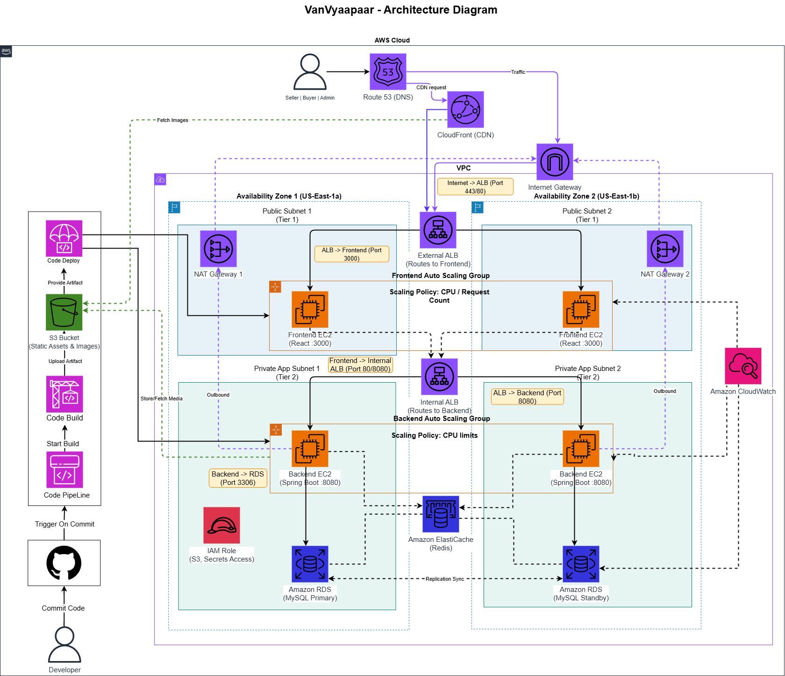

# VanVyaapaar — Tribal Crafts E-Commerce Platform

> A production-grade e-commerce backend for tribal artisans — built with Spring Boot 3, deployed on AWS with automated CI/CD.

---

## Highlights

| | |
|---|---|
| 🔗 **30+ REST APIs** | Buyer, Seller, Admin, Delivery, Payment, Chatbot |
| 🔐 **JWT + RBAC** | Stateless auth with role-based route protection |
| 🗺️ **Redis GEO Delivery** | Sub-100ms geo-spatial agent assignment |
| ⚡ **14 Kafka Topics** | Event-driven order and delivery processing |
| 📡 **WebSocket Tracking** | Real-time delivery updates via STOMP |
| ☁️ **AWS Deployment** | EC2, RDS, S3, CloudFront, ALB, Secrets Manager |
| 🐳 **Dockerized** | Full stack runs with a single `docker-compose up` |
| 💳 **Razorpay Payments** | Order creation, signature verification, failure handling |

---

## Architecture



---

## Backend Architecture

```
  HTTP Request
       │
       ▼
  Controller Layer          — REST endpoints, request validation, response mapping
       │
       ▼
  Service Layer             — Business logic, transactions, event publishing
       │
       ▼
  Repository Layer          — Spring Data JPA interfaces, custom JPQL queries
       │
       ▼
  ┌────────────────────────────────────────┐
  │  MySQL      Redis       Kafka          │
  │  (RDS)      (Geo +      (Event         │
  │             Cache)       Streaming)    │
  └────────────────────────────────────────┘
```

Each domain (Buyer, Seller, Admin, Delivery) follows the same layered structure independently — `BuyerController → BuyerService → BuyerServiceImpl → BuyerRepository`.

Security sits as a filter before the controller layer — `JwtAuthFilter` validates the token and sets the `SecurityContext` before any controller method is reached.

---

## Tech Stack

| Layer | Technology |
|---|---|
| Language | Java 17 |
| Framework | Spring Boot 3.5.6 |
| Auth | Spring Security + JWT (JJWT, stateless) |
| Database | MySQL 8 — Spring Data JPA + Hibernate |
| Cache / Geo | Redis — Spring Data Redis + Jedis |
| Events | Apache Kafka — Spring Kafka |
| Real-time | WebSocket — STOMP over SockJS |
| Payments | Razorpay SDK |
| Email | Spring Mail (Gmail SMTP) |
| Build | Maven + Lombok |

---

## Domain Model

The platform has three user roles — **Admin**, **Seller**, **Buyer** — all sharing a common `Base` entity via JPA joined-table inheritance.

```
Base (id, name, email, password, phone, address, pincode)
 ├── Buyer      → has Orders, Cart
 ├── Seller     → has Products, adminApprovalStatus
 └── Admin

Product        → belongs to Seller
Order          → belongs to Buyer + Seller, has OrderStatus enum, delivery address fields
Cart           → belongs to Buyer + Product
Payment        → belongs to Buyer, Razorpay fields
Delivery       → belongs to Order + DeliveryAgent, has DeliveryStatus enum
DeliveryAgent  → has GPS coordinates, workload, vehicle type
Notification   → belongs to any user role
Review         → belongs to Buyer + Product
Wishlist       → belongs to Buyer + Product
Coupon         → managed by Admin
Complaint      → managed by Admin
ServiceableArea
```

---

## API Reference

### Auth — `/auth`

| Method | Endpoint | Description |
|---|---|---|
| POST | `/auth/login` | Login for all roles — returns JWT + role + id |
| POST | `/auth/signup/buyer` | Buyer registration |
| POST | `/auth/signup/seller` | Seller registration — notifies admin, status = PENDING |

Login response:
```json
{ "token": "...", "role": "BUYER", "name": "Ravi", "id": 12 }
```

---

### Buyer — `/buyer` `[ROLE_BUYER]`

| Group | Endpoints |
|---|---|
| Products | `GET /buyer/products` — `GET /buyer/products/{id}` |
| Search | `GET /buyer/search?keyword=` — `GET /buyer/filter/category?category=` — `GET /buyer/filter/price?min=&max=` |
| Cart | `POST /{buyerId}/cart/add/{productId}` — `GET /{buyerId}/cart` — `PUT /cart/{cartItemId}` — `DELETE /cart/{cartItemId}` |
| Orders | `POST /{buyerId}/orders` — `GET /{buyerId}/orders` |
| Wishlist | `POST /{buyerId}/wishlist/{productId}` — `GET /{buyerId}/wishlist` — `DELETE /{buyerId}/wishlist/{productId}` |
| Reviews | `POST /reviews` — `GET /products/{productId}/reviews` |
| Profile | `GET /{buyerId}/profile` — `PUT /{buyerId}/profile` |

---

### Seller — `/seller` `[ROLE_SELLER]`

| Group | Endpoints |
|---|---|
| Profile | `GET /{sellerId}` — `PUT /{sellerId}` — `DELETE /{sellerId}` |
| Products | `POST /{sellerId}/products` — `GET /{sellerId}/products` — `PUT /products/{productId}` — `DELETE /products/{productId}` |
| Orders | `GET /{sellerId}/orders` — `PUT /orders/{orderId}/status?status=` |
| Dashboard | `GET /{sellerId}/dashboard` — total sales, monthly sales, pending orders, product count |
| Analytics | `GET /{sellerId}/analytics?period=month` |
| Notifications | `GET /{sellerId}/notifications` |

---

### Admin — `/admin` `[ROLE_ADMIN]`

| Group | Endpoints |
|---|---|
| Dashboard | `GET /admin/dashboard/metrics` |
| Sellers | `GET /sellers` — `GET /sellers/pending?status=` — `PUT /sellers/{id}/approve` — `PUT /sellers/{id}/suspend` — `PUT /sellers/{id}/delete` |
| Buyers | `GET /buyers` — `GET /buyers/{id}` — `DELETE /buyers/{id}` — `PUT /buyers/{id}/suspend` |
| Products | `GET /products` — `DELETE /products/{id}` |
| Orders | `GET /orders` — `GET /orders/{id}` |
| Coupons | `GET /coupons` — `POST /coupons` — `PUT /coupons/{id}` — `PUT /coupons/{id}/deactivate` — `DELETE /coupons/{id}` |
| Complaints | `GET /complaints` — `PUT /complaints/{id}/close` |
| Profile | `GET /profile` — `PUT /profile/{id}` — `PUT /profile/change-password` |

---

### Payment — `/payment`

Razorpay integration. Delivery is created only after payment is confirmed.

| Method | Endpoint | Description |
|---|---|---|
| POST | `/payment/create-order` | Creates Razorpay order, returns orderId + keyId |
| POST | `/payment/verify` | Verifies HMAC signature |
| POST | `/payment/success` | Marks payment SUCCESS → triggers delivery creation |
| POST | `/payment/failure` | Marks payment FAILED → sends failure notification |
| GET | `/payment/buyer/{buyerId}` | Payment history |

---

### Delivery — `/api/delivery`

| Method | Endpoint | Description |
|---|---|---|
| POST | `/delivery/{orderId}` | Create delivery for order |
| GET | `/delivery/track/{trackingId}` | Public tracking |
| PUT | `/delivery/{id}/status` | Update delivery status |
| PUT | `/delivery/agents/{agentId}/location` | Agent GPS update → publishes Kafka event |
| GET | `/delivery/buyer/{buyerId}` | Buyer's deliveries |
| GET | `/delivery/seller/{sellerId}` | Seller's deliveries |
| GET | `/delivery/agents/nearby` | Find agents near coordinates |

Agent assignment uses Redis geo-spatial indexing — multi-radius search (5km → 10km → 15km) with scoring:
```
Score = (Distance × 0.4) + (Availability × 0.3) + (Rating × 0.2) + (Workload × 0.1)
```
Falls back to DB query if Redis is unavailable.

---

### Other Endpoints

| Controller | Path | Purpose |
|---|---|---|
| HealthController | `/api/health` | Redis, WebSocket, DB, Kafka status |
| NotificationController | `/api/notifications` | In-app notifications per user |
| ChatbotController | `/api/chatbot` | Product/order Q&A chatbot |
| MetricsController | `/api/metrics` | Performance counters |
| BatchGeoController | `/api/batch-geo` | Bulk agent location updates |
| WebSocketController | `/ws` | STOMP WebSocket endpoint |

---

## Security

JWT stateless auth — `JwtAuthFilter` runs on every request, extracts the token, and sets `SecurityContext`.

```
POST /auth/login  →  JWT (10h expiry)  →  include as  Authorization: Bearer <token>
```

Route protection:
```
/buyer/**    →  ROLE_BUYER
/seller/**   →  ROLE_SELLER
/admin/**    →  ROLE_ADMIN
/auth/**     →  public
/payment/**  →  public
/api/delivery/track/**  →  public
```

---

## Event-Driven Layer (Kafka)

Key delivery actions publish domain events. The system continues to work if Kafka is unavailable — publishing failures are caught and logged without breaking the request.

```
Agent location update  →  AgentLocationUpdatedEvent  →  agent.location-updated
Order placed           →  OrderCreatedEvent           →  order.created
Delivery assigned      →  DeliveryAssignedEvent       →  delivery.assigned
Delivery completed     →  DeliveryDeliveredEvent      →  delivery.delivered
```

EventConsumer bridges Kafka → WebSocket, broadcasting updates to connected clients in real time.

**14 topics** across order, delivery, agent, and system domains.

---

## Real-Time WebSocket Channels

```
/topic/buyer/{buyerId}     ←  order status, delivery updates
/topic/agent/{agentId}     ←  new assignments, location ack
/topic/delivery/{id}       ←  live tracking
/topic/admin               ←  system-wide monitoring
```

STOMP over SockJS — <50ms broadcast latency.

---

## AWS Infrastructure

Infrastructure as code via CloudFormation — single command deploys the full production environment.

| Service | Role |
|---|---|
| **EC2 + Auto Scaling** | Frontend (nginx) and Backend (Spring Boot) with auto scaling |
| **Application Load Balancer** | Routes `/auth/*`, `/buyer/*`, `/seller/*`, `/admin/*` → backend; `/*` → frontend |
| **RDS MySQL** | Managed database in private subnet |
| **S3 + CloudFront** | Product image storage + global CDN |
| **Secrets Manager** | RDS credentials — never hardcoded |
| **CodePipeline** | `git push` → build → deploy, fully automated |

## Traffic Flow

```
User Browser
│
▼
Application Load Balancer  ←──  CloudFront (product images via S3)
│
├── /auth, /buyer, /seller, /admin  ──►  Backend EC2 (Spring Boot :8080)
│                                               │
│                                               ▼
│                                         RDS MySQL (private subnet)
│
└── /*  ──►  Frontend EC2 (nginx :80 → React SPA)
```

## Scale Down (Cost Saving)

```powershell
aws autoscaling update-auto-scaling-group --auto-scaling-group-name vanvyaapaar-prod-FrontendASG-LTbPpCvjkvzN --min-size 0 --desired-capacity 0 --region us-east-1
aws autoscaling update-auto-scaling-group --auto-scaling-group-name vanvyaapaar-prod-BackendASG-4JT22BOEQJiO --min-size 0 --desired-capacity 0 --region us-east-1
```

## Scale Up (Bring Back)

```powershell
aws autoscaling update-auto-scaling-group --auto-scaling-group-name vanvyaapaar-prod-FrontendASG-LTbPpCvjkvzN --min-size 1 --desired-capacity 1 --region us-east-1
aws autoscaling update-auto-scaling-group --auto-scaling-group-name vanvyaapaar-prod-BackendASG-4JT22BOEQJiO --min-size 1 --desired-capacity 1 --region us-east-1
git commit --allow-empty -m "Bring up" && git push origin main
```

---

## Running Locally

**Prerequisites:** Java 17, MySQL 8, Redis — Kafka is optional (system degrades gracefully)

```bash
cd vanpaayaar-backend
./mvnw spring-boot:run
```

**With Docker (full stack):**
```bash
docker-compose up
```

Backend starts on `http://localhost:8080`

---
